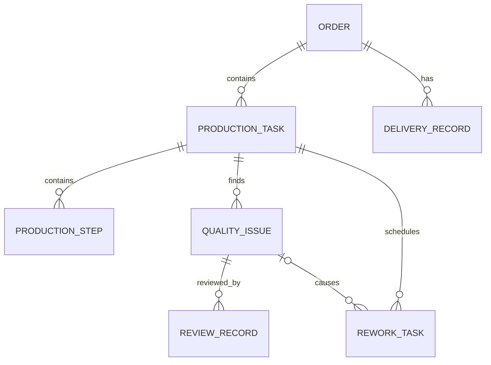

# M0.2 业务领域模型

## 1. 目标与边界

M0.2 为 Java `business-service` 建立订单生产链路的持久化模型，使业务事实能够由
Spring Data JPA 通过 PostgreSQL 查询。M0.3 已补充固定演示数据，M0.4 已在模型之上
增加只读 HTTP 查询边界，M0.5 已增加复核/返工写入及幂等、版本和操作日志保护；统一
错误响应和 Trace ID 仍不属于当前实现。

业务聚合以 `Order` 为根，关系如下：



概念架构中的 `QualityTask` 和 `DeliveryBatch` 是后续可扩展的业务容器。M0.2 任务清单
没有要求其实体、DTO 或数据库表，因此当前将 `QualityIssue` 直接归属
`ProductionTask`，将 `DeliveryRecord` 直接归属 `Order`。若后续出现一次质检包含多个
问题、一次交付批次包含多个记录的业务需求，应通过新的 Flyway 迁移增加容器和外键，
不能改写已经执行的 `V1` 迁移。

## 2. 聚合与数据流

创建完整业务链路时，由聚合根维护双向关系：

```text
Order.addTask
→ ProductionTask.addStep / addQualityIssue / addReworkTask
→ QualityIssue.addReviewRecord
→ Order.addDeliveryRecord
→ OrderRepository.save
→ JPA 级联持久化整个聚合
```

查询时既可以从 `OrderRepository` 沿只读集合导航，也可以通过各对象的 Repository
按业务 ID 独立定位。集合只暴露不可修改视图，调用方不能绕过聚合方法破坏归属关系。

## 3. 实体与数据库映射

| Java 实体 | 数据库表 | 主键 | 关键字段 | 上级对象 |
| --- | --- | --- | --- | --- |
| `Order` | `production_orders` | `order_id` | `product_type`, `status` | 聚合根 |
| `ProductionTask` | `production_tasks` | `task_id` | `status`, `version` | `order_id` |
| `ProductionStep` | `production_steps` | `step_id` | `step_name`, `sequence_number`, `status` | `task_id` |
| `QualityIssue` | `quality_issues` | `issue_id` | `issue_type`, `status`, `description` | `task_id` |
| `ReviewRecord` | `review_records` | `review_id` | `status`, `review_comment` | `issue_id` |
| `ReworkTask` | `rework_tasks` | `rework_task_id` | `status`, `reason` | `task_id`，可选 `source_issue_id` |
| `DeliveryRecord` | `delivery_records` | `delivery_id` | `status` | `order_id` |

所有主键均使用稳定、可读的业务 ID，例如 `ORDER-003` 和 `ISSUE-001`，不由数据库随机
生成。枚举通过 `EnumType.STRING` 保存，便于数据库、Java、Python 和前端共享同一词汇，
并避免枚举位置变化造成历史数据含义改变。

## 4. 关系、约束与删除规则

- `Order` 删除时级联删除其生产任务与交付记录。
- `ProductionTask` 删除时级联删除步骤、质检问题与返工任务。
- `QualityIssue` 删除时级联删除复核记录；被返工任务引用时，
  `source_issue_id` 置空，返工历史仍保留到所属生产任务删除为止。
- 同一生产任务内 `sequence_number` 唯一且必须大于零。
- 所有状态字段同时受到 Java 枚举和 PostgreSQL `CHECK` 约束保护。
- 实体构造器拒绝空业务 ID、空必填文本或空状态。
- 子对象一旦加入聚合，不允许重新挂接到另一个订单、任务或质检问题。
- 返工任务只能引用与自己属于同一生产任务的质检问题。

JPA 使用 `ddl-auto=validate`，启动时只校验映射，不自动改表；数据库结构只允许通过
Flyway 版本化迁移演进。

## 5. 跨服务状态词汇

状态值是未来 Java API、Python Tool 与前端契约的固定字符串，完整定义见
`docs/API_CONTRACT.md`。当前模型包含：

- `OrderStatus`
- `ProductionTaskStatus`（生产步骤和返工任务复用）
- `QualityIssueStatus`
- `ReviewStatus`
- `DeliveryStatus`

新增、删除或重命名状态属于接口与数据契约变更，必须同步 Java 枚举、Flyway 约束、
DTO、接口文档及跨服务契约测试。

## 6. ORDER-003 黄金链路

固定数据和 Repository 集成测试共同维护以下链路：

```text
ORDER-003 (QUALITY_CHECKING)
→ TASK-003 (COMPLETED)
→ ISSUE-001 (COORDINATE_SYSTEM, OPEN)
→ REVIEW-003 (PENDING)
→ DELIVERY-003 (BLOCKED)
```

Flyway V2 负责真正创建可重置的 `ORDER-001`～`ORDER-005`；M0.4 HTTP 契约测试从
真实启动的 Spring 服务查询同一组事实。

## 7. M0.4 查询边界

查询调用链固定为：

```text
OrderQueryController / TaskQueryController
→ BusinessQueryService（只读事务）
→ 领域 Repository（按业务 ID、状态和业务顺序查询）
→ Entity 映射为 DTO / 响应 Schema
→ JSON
```

HTTP 层不直接序列化 JPA Entity。这样可以避免懒加载关系、循环引用和数据库内部结构
泄漏到后续 Python Tool 契约。关联集合始终返回数组：父资源存在但没有任务、问题或
复核记录时返回 `200` 与空数组；父资源本身不存在时返回 `404`。

步骤按 `sequenceNumber` 排序，其他集合按稳定业务 ID 排序。确定性顺序不会改变业务
事实，但能降低 Tool Schema 消费、快照比较和 Agent 回归评测中的无意义波动。完整
路径与响应示例见 `docs/API_CONTRACT.md`。

## 8. M0.5 写入一致性边界

写接口沿用聚合关系创建 `ReviewRecord` 或 `ReworkTask`，并在同一个数据库事务中完成：

```text
身份/参数校验
→ 预占并核对 Idempotency-Key
→ 重查任务和质检问题
→ 校验状态、归属和重复返工
→ 级联持久化业务记录
→ WHERE task_id = ? AND version = ? 原子递增版本
→ 完成幂等记录并写 operation_logs
→ 返回业务结果和新版本
```

`idempotency_records` 保存请求指纹和首次成功结果引用，使网络重试可重放同一响应；
`operation_logs` 保存关键前后状态和幂等键哈希，不保存原始幂等键。`ProductionTask.version`
同时映射为 JPA `@Version` 并暴露在查询 DTO 中，写接口使用条件更新确保并发冲突能在
事务内部转换为 `409`，而不是在提交后成为不可控的 `500`。

复核写入当前只新增复核历史，返工写入只新增 `PENDING` 任务；它们不隐式迁移质检问题、
订单或交付状态。因此现有跨对象一致性校验器仍作为独立规则组件，待后续真正修改这些
状态的写操作再接入事务门禁。
