# 当前系统情况与架构思维导图

> 基线日期：2026-08-18。当前开发进度以 `docs/STATUS.md` 为准；本图只把已经实现的能力描述为现状，
> M3及M4.1～M4.6已完成；M4.7及后续内容均标记为待建设。

## 系统全景

```mermaid
mindmap
  root((遥感数据产线 Agent))
    项目定位
      遥感数据生产协同
        生产订单
        生产任务
        质量检查
        复核
        交付
      黄金链路 ORDER-003
        TASK-003 已完成生产
        ISSUE-001 坐标系问题未关闭
        复核状态 PENDING
        交付状态 BLOCKED
        阻塞阶段 QUALITY_REVIEW
        建议创建返工任务并重新提交复核
    当前进度
      已完成 M0 业务数据与 Java 接口
      已完成 M1 Python Tool 层
      已完成 M2 确定性订单诊断
      已完成 M3 页面上下文与路由
        已完成 M3.1 页面上下文
        已完成 M3.2 会话上下文
        已完成 M3.3 意图定义
        已完成 M3.4 路由 Prompt
        已完成 M3.5 参数合并优先级
        已完成 M3.6 置信度和澄清
        已完成 M3.7 路由评测数据
      M4 RAG 建设中
        已完成 M4.1 规范文档准备
          14份当前有效演示规范
          2份历史失效演示规范
          JSON元数据与替代关系
        已完成 M4.2 知识库数据模型
          严格DocumentCatalog元数据契约
          knowledge_documents文档表
          knowledge_chunks分块表
          pgvector向量字段
          数据库生成全文检索字段
        已完成 M4.3 文档解析和分块
          Markdown与纯文本统一Loader
          UTF-8与换行规范化
          Markdown标题层级路径
          超长章节确定性二次切分
          稳定Chunk ID
          规范化内容哈希重复检测
        已完成 M4.4 Embedding入库
          OpenAI兼容Provider契约
          固定1536维批量向量
          瞬时错误有限退避
          pgvector重新索引
          Provider模型与索引版本记录
        已完成 M4.5 关键词检索
          原文与章节标题检索文档
          中文双字词元预处理
          GIN全文索引
          ts_rank_cd关键词分数
        已完成 M4.6 向量检索
          同Provider模型版本Query Embedding
          HNSW余弦距离索引
          TopK与相似度阈值
          余弦相似度分数
        下一步 M4.7 元数据过滤
      当前没有阻塞
    三层系统架构
      Web Console
        技术栈
          Vue 3
          TypeScript
          Vite
          Pinia
          Axios
          Element Plus
        已实现职责
          展示五个固定订单
          读取 Java 订单与总览接口
          订单诊断侧边栏
          展示阻塞阶段 根因 证据 建议
          展示 Run ID Trace ID 失败步骤
          订单页面 Context Adapter 已接入
        已准备但未接入页面
          任务详情 Context Adapter
          质检问题 Context Adapter
        同源代理
          business-api 转发 Java
          agent-api 转发 Python
      Agent Service
        技术栈
          Python 3.12
          FastAPI
          Pydantic
          LangGraph
          SQLAlchemy Async
          Alembic
          httpx
        HTTP 能力
          订单诊断 API
          开发环境 Tool 调试 API
          健康检查
        意图路由契约
          六类稳定 Intent
          必填订单或任务参数
          四类业务 Skill 映射
          UNKNOWN 无 Skill
          缺参和 UNKNOWN 强制澄清
          router-v3 中文 System Prompt
          页面与会话 JSON 注入
          RouterResult JSON Schema
          Schema 失败重试一次
          失败回退 UNKNOWN
          四级实体来源
          固定参数优先级
          冲突记录与同级多值不猜测
          实体用户原文证据校验
          高中低置信度分级
          缺参和候选冲突确定性澄清
          用户确认补参后恢复原意图
          60条固定评测样本
          意图准确率与参数完整率
          六意图混淆矩阵
          脱敏失败样本JSONL
          尚无具体模型和 HTTP 入口
        Tool 层
          七个只读业务 Tool
            订单详情
            关联任务
            任务详情
            生产进度
            质检问题
            复核结果
            交付状态
          明确输入输出 Schema
          权限门禁
          有限重试
          Run 内重复调用检测
          统一错误映射
        确定性 Workflow
          load_context
          load_order
          load_tasks
          load_progress
          load_quality
          load_review
          load_delivery
          validate_page_context
          diagnose_by_rules
          generate_diagnosis
          refine_diagnosis 可选
        运行可观测性
          Session
            最小业务上下文
            用户所有权隔离
            30分钟默认滑动TTL
          Message
          Run
          Step
          成功结果快照
          失败错误码与失败节点
        知识持久化基础
          文档身份与内容哈希
          八个检索元数据字段
          生命周期与替代关系
          稳定分块身份和章节路径
          固定1536维向量字段
          当前Provider模型和索引版本
          中文双字检索文档与生成列
          GIN全文索引
          HNSW余弦索引
        知识检索基础
          安全关键词查询预处理
          关键词相关度排序
          Query Embedding
          索引身份隔离
          向量TopK与阈值
        知识解析基础
          显式格式Loader注册表
          路径逃逸与标题不一致拦截
          标题分节和超长切分
          章节路径和近似token数
          稳定内容哈希与Chunk ID
          批内及既有哈希重复检测
      Business Service
        技术栈
          Java 21
          Spring Boot
          Spring Data JPA
          Flyway
        业务事实权威
          订单
          任务
          生产步骤
          质检问题
          复核记录
          交付记录
        已实现接口
          八个只读查询接口
          复核写接口
          返工任务写接口
          统一响应和 Trace ID
          开发故障模拟
        写入保护
          REVIEWER 角色
          幂等键
          expectedVersion 乐观并发
          操作日志
      PostgreSQL
        PostgreSQL 16 与 pgvector 镜像
        Java 管理业务事实表
        Python 管理 Agent 运行与知识元数据表
        当前数据库角色尚未隔离
        vector扩展已由Alembic启用
    页面上下文安全边界
      PageContext 只是客户端提示
        current_system
        current_page
        order_id
        task_id
        issue_id
        product_type
        user_role
      前端快速防错
        Adapter 校验页面对象父子关系
      Python 请求前门禁
        严格 Schema
        顶层订单与页面订单一致
        身份 Header 与页面角色一致
        当前只允许 REVIEWER 诊断
      Java 事实重校验
        订单与产品匹配
        任务真实属于订单
        质检问题真实属于任务
      不参与当前裁决
        batch_id 尚无 Java 事实
        satellite_type 尚无 Java 事实
    订单诊断主链路
      用户在订单页发起诊断
      前端生成 PageContext
      请求携带身份与 Trace
      首轮创建 Session Message Run
      后续可复用 session_id
        继承当前订单或任务
        追加消息稳定序号
        更新最近诊断 Run
      Workflow 调用六个 Java 只读 Tool 节点
      页面资源归属重校验
      确定性规则决定阻塞阶段
      规则生成诊断结果
        summary
        root_causes
        Tool 字段级 evidence
        suggestions
        confidence
      可选模型只整理文案
        不得修改订单
        不得修改阻塞阶段
        不得修改证据
        失败时回退规则结果
      返回结果并保存 Run Step
    不可破坏的事实边界
      业务事实只来自 Java Tool
      页面参数不能成为业务事实
      模型只负责路由 归纳 解释 草稿
      规范结论未来只来自带版本引用的 RAG
      写操作必须人工确认
      Java 在确认时重新校验权限 状态 版本
    当前测试与验收
      Python
        345 passed
        35 个外部环境用例由专用门禁覆盖
        Ruff 通过
        mypy strict 通过
      PostgreSQL 持久化与 API
        34 passed
        关键词与向量检索集成通过
      Web
        7 个测试文件
        16 passed
        生产构建通过
      真实跨服务 E2E
        8 passed
        真实 Java HTTP PostgreSQL
        五个固定订单阶段稳定
        ORDER-003 四条字段级证据稳定
    当前明确未实现
      具体路由模型 HTTP入口与动态分发
      自然语言澄清HTTP交互
      真实路由模型评测
      全目录入库CLI定时任务或HTTP入口
      真实Provider语义质量评测
      元数据过滤与历史规范门禁
      混合检索与规范引用
      动态 Agent 决策
      Agent 侧写操作 Approval
      SSE 流式输出
      真实认证系统
      具体模型客户端和真实模型评测
      崩溃恢复与分布式调用去重
    后续路线
      M3 意图 路由 参数合并 澄清
      M4 RAG
      M5 动态 Agent
      M6 人工确认回写
      M7 Run Step SSE 与评测
```

## 阅读要点

1. 当前系统已经具备完整的确定性订单诊断链路，但还不是动态 Agent：业务对象和节点顺序仍由固定
   Workflow 控制。
2. Web 页面、Python Agent 和 Java 业务服务之间存在明确的事实边界。页面上下文负责提示当前对象，
   Python负责编排和解释，Java负责可信业务事实、权限和最终写入。
3. Java已经具备复核与返工写接口，但Python Agent尚未建设Approval链路，因此当前诊断建议只能展示，
   不会自动执行。
4. 当前下一最小任务是M4.7元数据过滤；全目录入库入口、真实Provider评测、混合检索、规范引用、动态分发、
   人工确认回写和SSE仍属于后续里程碑。

## 相关文档

- [当前开发状态](STATUS.md)
- [项目路线图](ROADMAP.md)
- [接口契约](API_CONTRACT.md)
- [领域模型](DOMAIN_MODEL.md)
- [固定演示数据](DEMO_DATA.md)
- [详细开发计划](../doc/detailed-plan.md)
